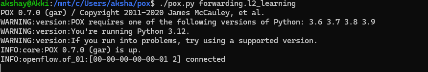
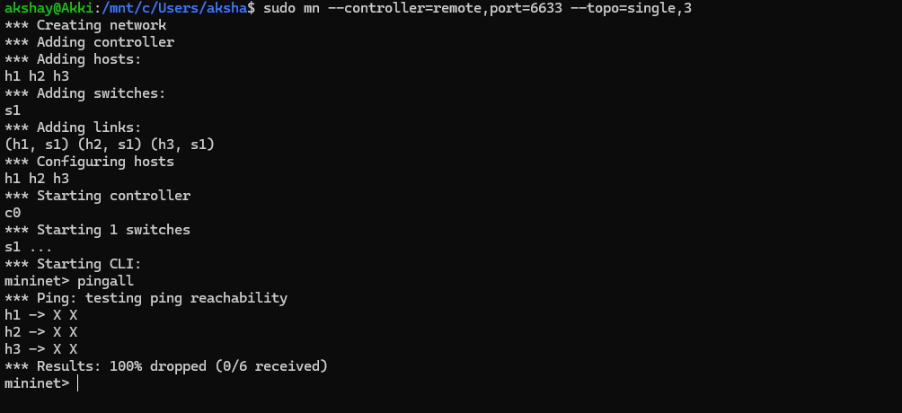
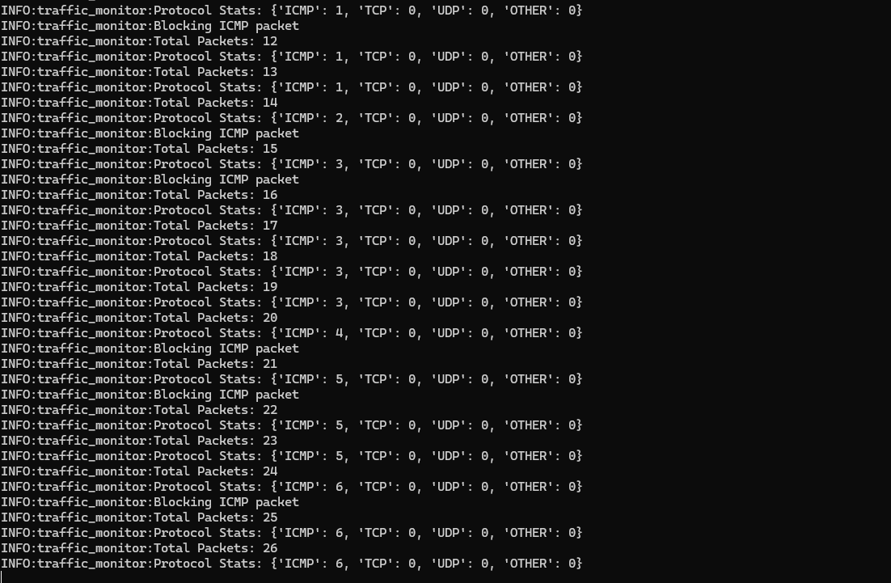
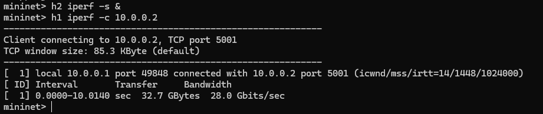
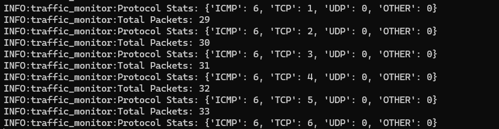
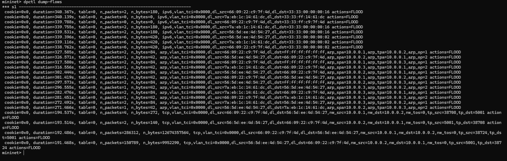

# Traffic Monitoring and Statistics Collector using SDN (POX + Mininet)

## 📌 Problem Statement

The objective of this project is to design and implement an SDN-based traffic monitoring system using Mininet and a POX controller. The system demonstrates controller-switch interaction, flow rule installation, and network behavior monitoring.

---

## ⚙️ Tools & Technologies Used

* Mininet (Network Emulator)
* POX Controller (OpenFlow Controller)
* Open vSwitch
* Python
* iperf (Traffic generation)

---

## 🏗️ Network Topology

* Single switch topology
* 3 hosts (h1, h2, h3)
* Remote POX controller

---

## 🚀 Setup and Execution Steps

### Step 1: Start POX Controller

```bash
cd pox
./pox.py traffic_monitor
```

### Step 2: Start Mininet

```bash
sudo mn --controller=remote,port=6633 --topo=single,3
```

### Step 3: Test Connectivity

```bash
pingall
```

### Step 4: Generate Traffic

```bash
iperf h1 h2
```

---

## 🧠 Controller Functionality

* Handles PacketIn events
* Classifies packets (ICMP, TCP, UDP)
* Maintains traffic statistics
* Installs flow rules dynamically
* Blocks ICMP traffic (demonstration of policy enforcement)

---

## 🧪 Test Cases

### ✔ Test Case 1: Normal Traffic (TCP)

* Command: `iperf h1 h2`
* Result: Successful data transfer
* Observation: TCP packets counted and allowed

### ✔ Test Case 2: Blocked Traffic (ICMP)

* Command: `pingall`
* Result: Packet loss observed
* Observation: ICMP packets blocked by controller

---

## 📊 Expected Output

* Packet statistics displayed in controller logs
* Protocol-wise traffic distribution
* Flow rules installed dynamically
* Selective traffic blocking demonstrated

---

## 📸 Proof of Execution

### 🔹 Controller–Switch Connection


### 🔹 Ping Test (ICMP Blocked)



### 🔹 TCP Traffic (iperf)


### 🔹 Controller Logs


### 🔹 Flow Table


---

## 📚 References

* Mininet Documentation
* POX Controller Documentation
* OpenFlow Switch Specification
